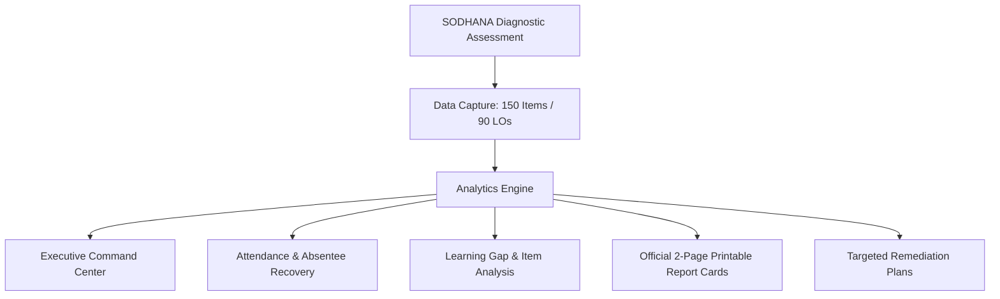
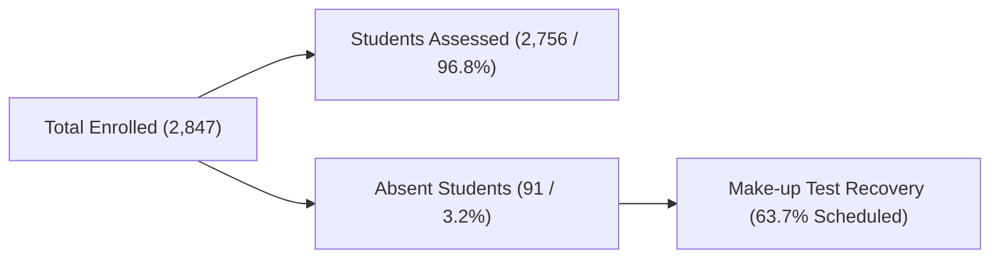
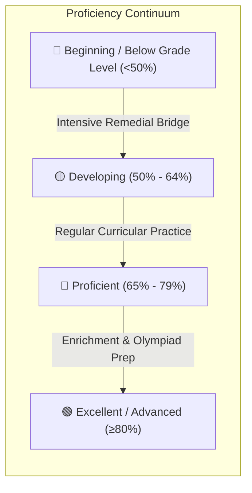
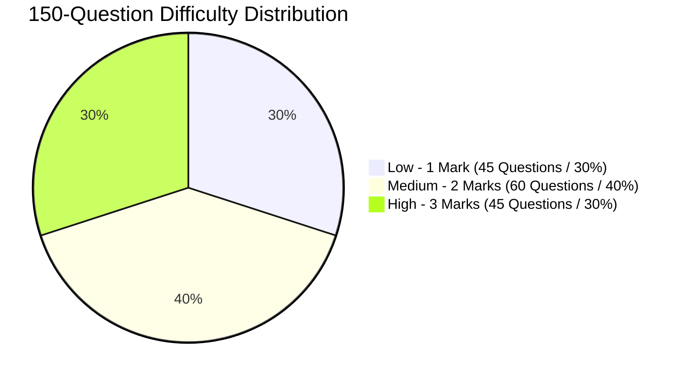
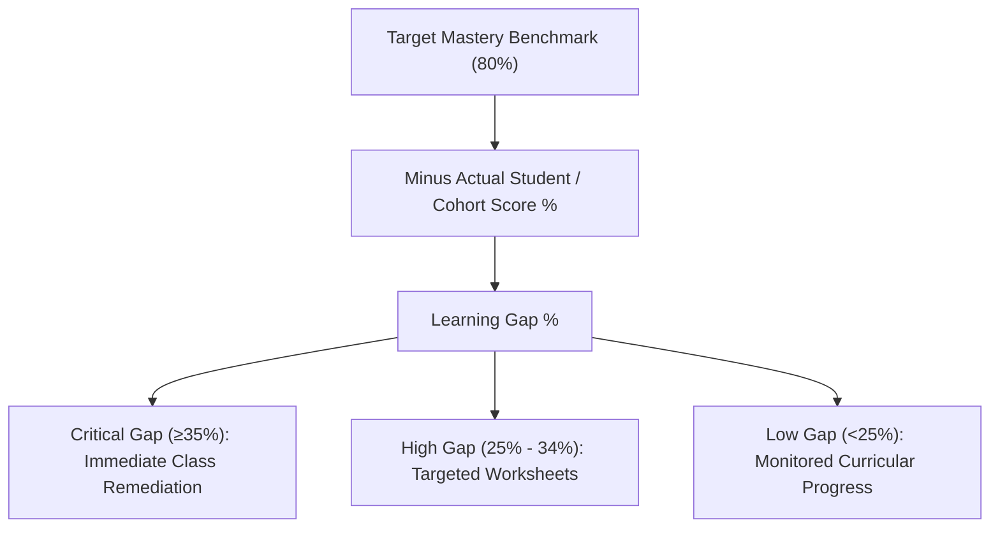
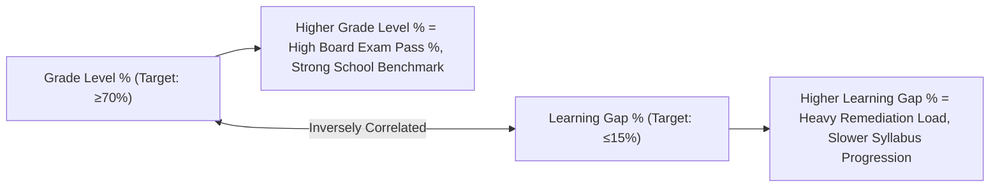
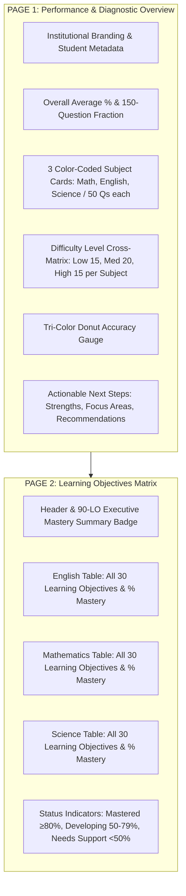
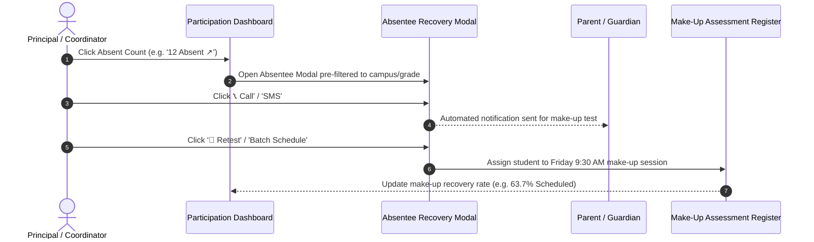
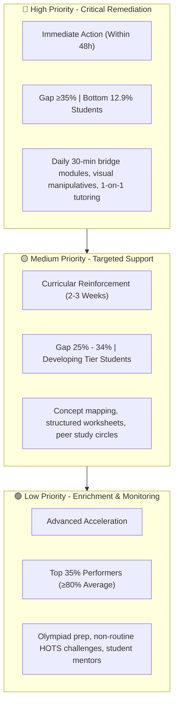

# 📊 The Global Edge School — SODHANA Assessment Dashboard
## Complete Metric Definitions, Formulas, Pedagogical Framework & Operational Guide

---

## 📑 Table of Contents
1. [Executive Overview & Assessment Blueprint](#1-executive-overview--assessment-blueprint)
2. [Diagnostic Framework & Core Structure](#2-diagnostic-framework--core-structure)
3. [Comprehensive Glossary of Dashboard Terms & Metrics](#3-comprehensive-glossary-of-dashboard-terms--metrics)
   - [A. Attendance, Enrollment & Turnout Metrics](#a-attendance-enrollment--turnout-metrics)
   - [B. Performance, Proficiency & Achievement Metrics](#b-performance-proficiency--achievement-metrics)
   - [C. Question-Level & Psychometric Difficulty Metrics](#c-question-level--psychometric-difficulty-metrics)
   - [D. Learning Gap & Competency Deficit Metrics](#d-learning-gap--competency-deficit-metrics)
   - [E. Institutional & School-Level Metrics](#e-institutional--school-level-metrics)
4. [Mathematical Formulas & Calculation Rules](#4-mathematical-formulas--calculation-rules)
5. [The 2-Page Official Report Card Standard](#5-the-2-page-official-report-card-standard)
6. [Absentee Tracking & Recovery Protocol](#6-absentee-tracking--recovery-protocol)
7. [Tri-Tier Remediation & Intervention Roadmap](#7-tri-tier-remediation--intervention-roadmap)
8. [School Campus Directory (The Global Edge School)](#8-school-campus-directory-the-global-edge-school)

---

## 1. Executive Overview & Assessment Blueprint

The **SODHANA Diagnostic Assessment & Analytics Portal** is a standardized, competency-based educational evaluation system deployed across **The Global Edge School** branches. Its purpose is to diagnose students' foundational mastery, identify micro-learning gaps early, and drive data-informed instructional interventions before term-end and board examinations.

---

## 2. Diagnostic Framework & Core Structure

The assessment is administered across **Grades 3 through 10** in three foundational subjects: **Mathematics, English, and Science**.

| Subject | Questions Assessed | Low Difficulty (1 Mark) | Medium Difficulty (2 Marks) | High Difficulty (3 Marks) | Learning Objectives (LOs) |
| :--- | :---: | :---: | :---: | :---: | :---: |
| **📖 English** | **50 Questions** | 15 Questions | 20 Questions | 15 Questions | **30 LOs** |
| **📐 Mathematics** | **50 Questions** | 15 Questions | 20 Questions | 15 Questions | **30 LOs** |
| **🔬 Science** | **50 Questions** | 15 Questions | 20 Questions | 15 Questions | **30 LOs** |
| **Total Blueprint** | **150 Questions** | **45 Questions (30%)** | **60 Questions (40%)** | **45 Questions (30%)** | **90 LOs Total** |

---

## 3. Comprehensive Glossary of Dashboard Terms & Metrics

### A. Attendance, Enrollment & Turnout Metrics

#### 1. **Total Enrolled**
* **Definition**: The total number of registered students in the active academic cohort across all campuses, grades, and sections.
* **Current Baseline**: `2,847 Students`.

#### 2. **Students Assessed**
* **Definition**: The number of students who physically completed the assessment on the scheduled test day.
* **Current Baseline**: `2,756 Students`.

#### 3. **Turnout % (Participation Rate)**
* **Definition**: The percentage of enrolled students who appeared for the assessment.
* **Formula**:
  $$\text{Turnout \%} = \left( \frac{\text{Students Assessed}}{\text{Total Enrolled}} \right) \times 100$$
* **Thresholds**:
  * 🟢 **High Turnout**: $\ge 95\%$ (Target achieved)
  * 🟡 **Moderate Turnout**: $90\% - 94.9\%$ (Requires standard attendance follow-up)
  * 🔴 **Low Turnout**: $< 90\%$ (Flagged for administrative review)

#### 4. **Absent Students (Absenteeism Count & Rate)**
* **Definition**: Students who were registered but missed the primary assessment date due to medical leave, family emergencies, official sports representation, or unexcused reasons.
* **Current Baseline**: `91 Students (3.2%)`.
* **Action Trigger**: Automatically opens the **Interactive Absentee Recovery Register** to schedule make-up tests and contact parents.

---

### B. Performance, Proficiency & Achievement Metrics

#### 1. **Average Score % (Composite Score)**
* **Definition**: The arithmetic mean score achieved across all 150 questions (50 Math + 50 English + 50 Science).
* **Current Benchmark**: `68.4%` (Proficient).

#### 2. **Below Grade Level (Beginning Tier / $< 50\%$)**
* **Definition**: Students whose overall score falls **below 50%**, indicating that they lack mastery of the foundational prerequisite competencies expected for their current chronological grade.
* **Educational Significance**: A Grade 5 student "Below Grade Level" in Mathematics is unable to perform Grade 3–4 arithmetic (e.g. basic multi-digit subtraction or place value). Without intervention, the deficit will compound exponentially in Grade 6.
* **Current Baseline**: `356 Students (12.9% of assessed cohort)`.

#### 3. **Proficiency Level Bands**
* **🟢 Excellent ($\ge 80\%$)**: Complete concept mastery; demonstrates deep application, analytical reasoning, and higher-order synthesis. Candidates for Olympiad and enrichment tracks.
* **🔵 Proficient ($65\% - 79\%$)**: Solid grade-level competency; accurately solves routine and multi-step problems with minimal guidance.
* **🟡 Developing ($50\% - 64\%$)**: Partial concept grasp; manages basic recall but falters on multi-step application or conceptual word problems.
* **🔴 Beginning / Below Grade Level ($< 50\%$)**: Severe foundational learning deficits; requires mandatory bridge courses and differentiated instruction.

---

### C. Question-Level & Psychometric Difficulty Metrics

#### 1. **Difficulty Tier Breakdown (1M / 2M / 3M)**
* **Low Tier (1 Mark &bull; 15 Qs per Subject &bull; 45 Qs Total / 30%)**:
  * Tests basic recall, definitions, formula recognition, and single-step arithmetic.
  * *Target Cohort Accuracy*: $\ge 80\%$.
* **Medium Tier (2 Marks &bull; 20 Qs per Subject &bull; 60 Qs Total / 40%)**:
  * Tests routine application, multi-step problem solving, and contextual reasoning.
  * *Target Cohort Accuracy*: $60\% - 75\%$.
* **High Tier (3 Marks &bull; 15 Qs per Subject &bull; 45 Qs Total / 30%)**:
  * Tests Higher Order Thinking Skills (HOTS), data interpretation, critical inference, and multi-concept synthesis.
  * *Target Cohort Accuracy*: $40\% - 55\%$.

#### 2. **Item Correct % & Incorrect % (Item Facility Index)**
* **Definition**: The percentage of students in the cohort who answered a specific question correctly.
* **Item Status Categorization**:
  * 🟢 **Good**: $\text{Correct} \ge 75\%$ (Concept well understood by cohort)
  * 🔵 **Moderate**: $50\% \le \text{Correct} < 75\%$ (Standard curricular practice required)
  * 🔴 **Critical**: $\text{Correct} < 50\%$ (Instructional blind spot; requires classroom re-teaching)

---

### D. Learning Gap & Competency Deficit Metrics

#### 1. **Critical Learning Gap**
* **Definition**: A specific learning competency or topic where the deficit between expected mastery standard ($80\%$) and actual cohort performance is **$\ge 35\%$**.
* **Formula**:
  $$\text{Learning Gap \%} = \text{Target Benchmark (80\%)} - \text{Actual Score \%}$$
* **Calculation Example**:
  * *Topic*: Grade 5 Mathematics — Fraction Division & Reciprocals.
  * *Expected Standard*: $85\%$.
  * *Actual Cohort Performance*: $40\%$.
  * *Calculation*: $85\% - 40\% = \mathbf{45\% \text{ Gap}}$ $\rightarrow$ Flagged as **Critical Priority**.

#### 2. **How Critical Gaps are Useful**
* **For Students & Parents**:
  * Eliminates vague feedback (e.g. *"weak in math"*) and replaces it with granular diagnostics (e.g. *"student understands multiplication but confuses reciprocal inversion in fraction division"*).
* **For Teachers**:
  * Reveals instructional blind spots before term-end exams, allowing teachers to adjust lesson pacing and design focused mini-lessons.
* **For Principals & Academic Directors**:
  * Directs academic funding, teacher mentoring, and timetable adjustments (e.g. assigning zero-period bridge classes to specific sections).

---

### E. Institutional & School-Level Metrics

#### 1. **Grade Level %**
* **Definition**: The proportion of students within a school branch or grade cohort performing at or above grade-appropriate standards ($\ge 65\%$ composite score with no critical conceptual failures).
* **Formula**:
  $$\text{Grade Level \%} = \left( \frac{\text{Students Scoring } \ge 65\%}{\text{Total Assessed Students}} \right) \times 100$$
* **Impact**: Direct indicator of overall curriculum delivery health. High Grade Level % means the school branch is effectively keeping students on track.

#### 2. **Learning Gap % (School-Level Aggregate)**
* **Definition**: The average deficit across all assessed learning objectives across the entire campus.
* **Formula**:
  $$\text{Aggregate Learning Gap \%} = \frac{\sum (\text{Target LO Score} - \text{Actual LO Score})}{\text{Total Number of LOs Assessed}}$$
* **Impact**: Measures institutional remediation burden. A campus with a high Learning Gap % (e.g. $>30\%$) will struggle with syllabus completion because teachers must constantly re-teach prerequisite concepts from earlier grades.

---

## 4. Mathematical Formulas & Calculation Rules

| Metric Name | Mathematical Formula | Purpose / Application |
| :--- | :--- | :--- |
| **Participation Rate (Turnout %)** | $\frac{\text{Assessed Count}}{\text{Enrolled Count}} \times 100$ | Evaluates test coverage and identifies absentee volume. |
| **Overall Assessment Average** | $\frac{\text{Total Correct Items across all 3 subjects}}{150} \times 100$ | Core composite student performance benchmark. |
| **Subject Accuracy %** | $\frac{\text{Correct Items in Subject}}{50} \times 100$ | Granular subject score out of 50 questions. |
| **Tier Difficulty Score** | $\text{Low: } \frac{x}{45} \cdot 100 \quad \text{Med: } \frac{y}{60} \cdot 100 \quad \text{High: } \frac{z}{45} \cdot 100$ | Measures student resilience across Bloom's taxonomy levels. |
| **Competency Gap %** | $\text{Target Standard (80\%)} - \text{Actual Cohort Score \%}$ | Identifies specific curricular deficits for intervention. |
| **School Grade-Level %** | $\frac{\text{Cohort Students } \ge 65\%}{\text{Cohort Total Assessed}} \times 100$ | Evaluates institutional effectiveness across campuses. |

---

## 5. The 2-Page Official Report Card Standard

Every student report card generated by the portal is strictly formatted for **2-Page A4 printing** (`page-break-before: always`):

---

## 6. Absentee Tracking & Recovery Protocol

When an administrator clicks on any **Absent Count** across the dashboard, the **Interactive Absentee Register** is launched with active recovery workflows:

* **Interactive Features**:
  * Multi-filtering by School Branch, Grade (3–10), Absence Reason (*Medical Leave, Family Emergency, Authorized Event, Unexcused*), and Retest Status.
  * Direct one-click SMS/Call trigger for parent communication.
  * One-click batch scheduling for all pending make-up assessments.
  * Instant spreadsheet export (`SODHANA_Absentee_Roster.csv`) and clean A4 printout.

---

## 7. Tri-Tier Remediation & Intervention Roadmap

---

## 8. School Campus Directory (The Global Edge School)

| Campus Branch | Location / Zone | Assessed Students | Turnout % | Avg Score % | Grade Level % | Learning Gap % | Priority Status |
| :--- | :--- | :---: | :---: | :---: | :---: | :---: | :---: |
| **The Global Edge School - Madhapur** | Hitec City (West Zone) | 185 | 98.0% | **72.4%** | 68% | 12% | 🟢 Benchmark Campus |
| **The Global Edge School - Financial District** | Financial District (Cyberabad) | 256 | 97.0% | **68.9%** | 62% | 18% | 🟢 Strong Proficiency |
| **The Global Edge School - Kukatpally** | Kukatpally (North Zone) | 142 | 96.0% | **65.8%** | 58% | 22% | 🟡 Targeted Review |
| **The Global Edge School - Gachibowli** | Gachibowli (South-West) | 198 | 94.0% | **64.5%** | 52% | 28% | 🟡 Targeted Review |
| **The Global Edge School - Banjara Hills** | Banjara Hills (Central Zone) | 108 | 91.0% | **62.1%** | 48% | 32% | 🔴 Priority Remediation |
| **The Global Edge School - Vasant Nagar** | Vasant Nagar (North-West) | 122 | 88.0% | **59.2%** | 42% | 38% | 🔴 High Priority Action |

---

*Document compiled for The Global Edge School Academic Council & NorthSouth Foundation Assessment Portal.*
